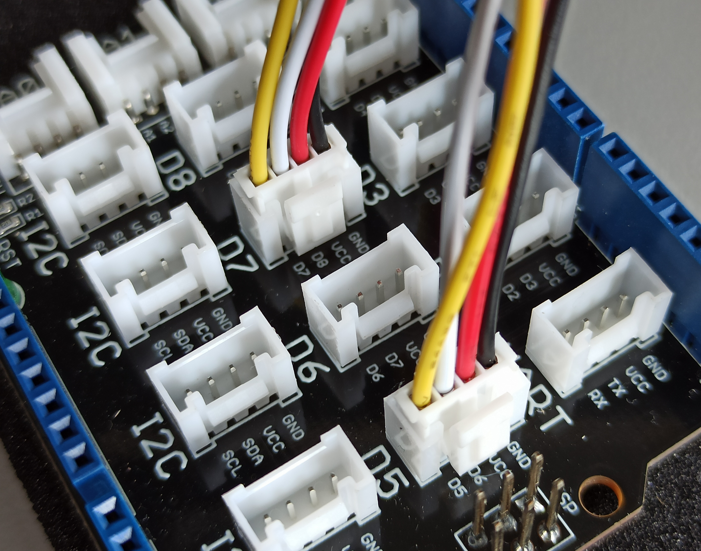

# Adaptación a Zephyr RTOS

> _Adaptación de la práctica Ball_Balance_Project de SOTR en MaRTE OS a Zephyr RTOS_

## Adaptación de las demos

### Demo del motor paso a paso (Stepper)

#### - Mapeo de pines utilizando HAL a través de STM32Cube:

El controlador del motor paso a paso tiene 4 pines: In1, In2, In3, In4. Estos pines están conectados a los conectores D7 y D5 de la placa de expansión BaseShield de Arduino. En concreto, los 4 pines del controlador están conectados a los pines D8, D7 (Conector D7), D6 y D5 (Conector D5) respectivamente.



> [Arduino Base Shield v2 PCB](Documentacion/Arduino%20Base%20Shield%20v2_PCB.pdf)

El mapeo de pines del Arduino Base Shield en la libreria HAL STM32Cube se describe en la [documentación oficial de la STM32F769I-DISCO](Documentacion/Documentacion%20STM32F769-Discovery-Kit.pdf), página 32.

-   El pin D8 (In1) se controla con la constante `GPIO_PIN_4` y la `GPIOJ`.
-   El pin D7 (In2) se controla con la constante `GPIO_PIN_3` y la `GPIOJ`.
-   El pin D6 (In3) se controla con la constante `GPIO_PIN_7` y la `GPIOF`.
-   El pin D5 (In4) se controla con la constante `GPIO_PIN_8` y la `GPIOC`.

En el código se renombran estas constantes para que sean más descriptivas.

> El ejemplo se suministra en la carpeta [/Ejemplos/Stepper/](Ejemplos/Stepper/).


https://user-images.githubusercontent.com/82649677/172708371-044bf6ed-739e-49b8-8e35-57e42337eb68.mp4


### Demo del sensor de distancia infrarrojo (Sharp)

El sensor de distancia infrarrojo esta conectado al conector A0 de la placa de expansión BaseShield de Arduino. Se obtiene el valor analógico por el pin A1 mapeado al `GPIO_PIN_4` de la `GPIOA`, utilizando la libreria HAL STM32Cube.

> El ejemplo se suministra en la carpeta [/Ejemplos/Sharp/](Ejemplos/Sharp/).


https://user-images.githubusercontent.com/82649677/172708457-4a6e58b9-3be3-4290-a254-f9ef57cb3525.mp4


## Adaptación de la práctica Ball_Balance_Project

Se ha empezado a adaptar la práctica Ball_Balance_Project de SOTR para Zephyr RTOS, a partir de las demos. También se han realizado modificaciones generales de características incompatibles ya detectadas.

-   [x] Adaptación del controller (Sensor Sharp).
-   [x] Adaptación de motor paso a paso (Stepper).
-   [ ] Adaptación del driver del LCD-TFT para la GUI.
-   [ ] Adaptación del programa principal.

### Estructura del proyecto:

```
Practica-SOTR_Ball_Balance_Project
├── CMakeLists.txt
├── include
│   ├── controller.h
│   ├── gui.h
│   ├── misc
│   │   ├── error_checks.h
│   │   └── timespec_operations.h
│   ├── screen.h
│   └── stepper_motor.h
├── Kconfig
├── prj.conf
└── src
    ├── controller.c
    ├── gui.c
    ├── lcd_driver.c
    ├── pract10_ball_balance.c
    ├── screen.c
    └── stepper_motor.c
```
