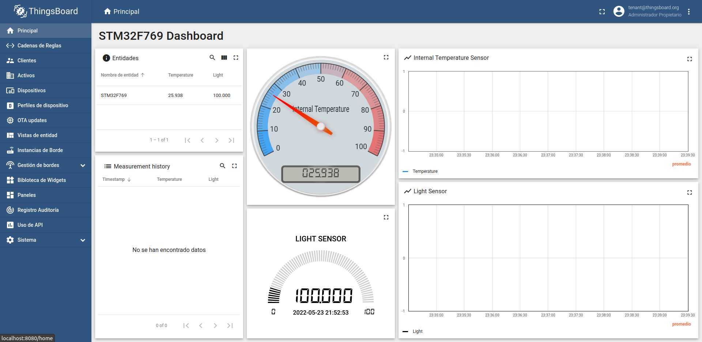

# Guía de inicio

## 1. Instalación del sistema operativo

Zephyr se ha instalado correctamente en Ubuntu 20.04 LTS siguiendo las indicaciones de la documentación oficial, para la versión sobre el entorno virtual en Python, que es la recomendada en la propia documentación.

> [Documentación oficial del sistema operativo Zephyr Project de Linux Foundation](https://docs.zephyrproject.org/latest/index.html) -
> [Repositorio oficial](https://github.com/zephyrproject-rtos/zephyr)

> [Características del sistema operativo Zephyr RTOS](https://docs.zephyrproject.org/latest/introduction/index.html)

## 2. Prueba básica con la placa STM32F769 Discovery Kit

Para empezar a trabajar es necesario activar el entorno virtual de Python:

```bash
source ~/zephyrproject/.venv/bin/activate
```

La compilación de un programa se realiza con `west build -b <board-name> example`.
Para pasar el binario a la memoria de la placa se ejecuta el comando `west flash`.
Es necesario que la compilación se realice dentro del directorio `/zephyr`.

> En algunos ejemplos se utiliza impresión por el puerto serie de la placa (dispositivo _/dev/ttyACM0_ al conectar por el conector USB). Para poder visualizar la información, se puede utilizar un terminal gráfico como CuteCom. Se puede instalar fácilmente en Ubuntu con `sudo apt-get install cutecom`.

Algunos del componentes o periféricos todavía no son compatibles a través del sistema operativo Zephyr RTOS.
> [Soporte de STM32F769 Discovery Kit utilizando Zephyr RTOS](https://docs.zephyrproject.org/latest/boards/arm/stm32f769i_disco/doc/index.html#)

### Blinky Sample

El programa hace parpadear un LED usando la API para la _GPIO_ propia del sistema operativo.

```
west build -p auto -b stm32f769i_disco samples/basic/blinky
```

### Hello World! Sample

Imprime "Hello World" en la consola, conectada al puerto serie de la placa (_dev/ttyACM0_).

```
west build -p auto -b stm32f769i_disco samples/hello_world
```

### Button Sample

Imprime un mensaje en la consola cada vez que se presiona un botón, haciendo uso de entrada _GPIO_ con interrupciones.

```
west build -p auto -b stm32f769i_disco samples/basic/button
```

### Basic Thread Sample

Este ejemplo demuestra la generación de varios threads mediante `K_THREAD_DEFINE()`. Genera tres hilos:

-   Los dos primeros controlan cada uno un LED. Estos LED, led0 y led1, se ejecuta en un bucle y la temporización de los leds es controlada por funciones separadas:

    -   `blink0()` controla led0 y tiene un ciclo de suspensión de 100ms
    -   `blink1()` controla led1 y tiene un ciclo de suspensión de 1000 ms

    Cuando cualquiera de estos thread alterna el estado de su LED, también envía información a una cola FIFO que identifica el thread/LED y cuántas veces se ha activado.

    -   El tercer hilo usa `printk()` para imprimir la información agregada a la cola FIFO en la consola del dispositivo.

```
west build -p auto -b stm32f769i_disco samples/basic/threads
```

### Touchscreen Sample

Este ejemplo demuestra cómo interactuar con un panel táctil. Cuando se detectan toques, se emite un mensaje de registro en la consola, que índica la posición del toque dentro del panel táctil.

```
west build -p auto -b stm32f769i_disco samples/drivers/kscan_touch/
```

## 3. Prueba básica de los sensores

### Sensor de temperatura interno y pin analógico A0 de Arduino

Este ejemplo muestra la lectura de la temperatura interna de la placa, mediante un sensor integrado y el valor del pin analógico A0 de la placa Arduino. Para leer el valor analógico es necesario utilizar un conversor ADC. Este ejemplo hace uso de la librería STM32Cube suministrada por el fabricante de la placa.

Este ejemplo se prueba con el sensor de luz analógico conectado al pin A0 de la placa Arduino.


> El ejemplo se suministra en la carpeta [/Ejemplos/HAL_Light\_&_Internal_Temp(ADC)/](<Ejemplos/HAL_Light_&_Internal_Temp(ADC)/>).

## 4. Prueba básica de las funciones de red

Los ejemplos de red se pueden utilizar conectando un cable normal Ethernet entre la placa y el host. Para configurar los parámetros del proyecto, en este caso de red, se hace uso de un archivo de configuración `prj.conf`, presente en el directorio principal del proyecto.

La configuración de direcciones IP de área local (LAN) por defecto es la siguiente:

```
CONFIG_NET_CONFIG_MY_IPV4_ADDR="192.0.2.1"
CONFIG_NET_CONFIG_PEER_IPV4_ADDR="192.0.2.2"
```

### Socket Echo Client Sample

La aplicación implementa un cliente UDP/TCP que enviará paquetes IPv4 o IPv6, esperará a que se envíen los datos y luego verificará que coincidan con los datos que se enviaron.

```
west build .p auto -b stm32f769i_disco samples/net/sockets/echo_client -- -DCONF_FILE="prj.conf overlay-log.conf"
```

### Socket Echo Server Sample

La aplicación implementa un servidor UDP/TCP que complementa la aplicación de muestra del cliente de eco: el servidor de eco escucha los paquetes IPv4 o IPv6 entrantes (enviados por el cliente de eco) y simplemente los devuelve.

```
west build -p auto -b stm32f769i_disco samples/net/sockets/echo_server/ -- -DCONF_FILE="prj.conf overlay-log.conf"
```

> Para enviar tráfico al servidor (la placa), podemos utilizar un generador de paquetes tipo Package Sender (`apt-get install packetsender`), o a través de la Shell del tipo bash de Linux:

```bash
echo "This is my TCP message" > /dev/tcp/192.0.2.1/4242
echo "This is my UDP message" > /dev/upd/192.0.2.1/4242
```

### MQTT Publisher Sample

[MQTT (MQ Telemetry Transport)](https://mqtt.org/) es un protocolo ligero de mensajería de publicación/suscripción optimizado para sensores pequeños y dispositivos móviles.
La aplicación de prueba es un cliente MQTT v3.1.1 que envía mensajes MQTT PUBLISH a un broker MQTT.

```
west build -p auto -b stm32f769i_disco samples/net/mqtt_publisher/
```

En una terminal de Linux, ejecutaremos el broker de MQTT _mosquitto_ (se puede instalar con `apt-get mosquitto`) y lo ejecutaremos con su configuración por defecto, es decir utilizando el puerto 1883:

```
mosquitto -v
```

> En el caso de que muestre un mensaje de error, porque el puerto ya está en uso, es necesario matar al demonio de _mosquitto_ ya ejecutándose en el sistema, para liberar el puerto. (`kill -9 <PID>`)

## 5. Prueba básica con la plataforma ThingsBoard

Para comprobar el funcionamiento de la plataforma ThingsBoard, vamos a enviar desde un PC con un cliente MQTT, datos a un panel de ThingsBoard.

Se han seguido los primeros pasos de la [guía de inicio rápido](https://thingsboard.io/docs/getting-started-guides/helloworld/?connectdevice=mqtt-linux), ya que la plataforma permite habilitar muchas más características, como la gestión de usuarios o alarmas, que no van a ser necesarias para esta práctica. Solo realizaremos los pasos necesarios para configurar el dispositivo y la creación de un Dashboard, para visualizar gráficas en tiempo real de los datos enviados desde la placa STM32F769.

Para esta prueba se utilizará la versión [Live Demo](https://demo.thingsboard.io), ya que no necesita de ninguna instalación en nuestro equipo. Alternativamente se puede instalar una versión en local según se indica en la documentación oficial.

> [Documentación oficial de ThingsBoard Community Edition](https://thingsboard.io/docs/) -
> [Repositorio oficial](https://github.com/thingsboard/thingsboard)

### Paso 1: Creación de un dispositivo

Se siguen los pasos de la [guía de inicio rápido](https://thingsboard.io/docs/getting-started-guides/helloworld/?connectdevice=mqtt-linux), para crear un dispositivo.

> Antes de crear el dispositivo se recomienda importar en el área de **Perfiles de dispositivo** de la aplicación, el [perfil de dispositivo para STM32F769](ThingsBoard/Plantillas/stm32f769_profile.json) proporcionado. Este perfil limita a que la comunicación se realice mediante el protocolo MQTT, y establece el nombre del TOPIC a usar para la comunicación, así como el Payload en formato JSON `{"type":value}`.

### Paso 2: Conexión del dispositivo mediante MQTT (simulado desde un PC)

Lo primero a realizar será instalar los clientes de _mosquitto_ en nuestra maquina Ubuntu:

```bash
sudo apt-get install mosquitto-clients
```

Para mandar una medición a ThingsBoard, se crea una publicación en el topic `v1/devices/me/telemetry`.

> En esta prueba el `$THINGSBOARD_HOST_NAME` es la dirección de la versión Live Demo: _demo.thingsboard.io_, en el caso de una instalación local: _localhost_, y el `$ACCESS_TOKEN` es el token copiado del dispositivo en el paso anterior.

Primero creamos una publicación del sensor de temperatura interna con un valor de 25:

```bash
 mosquitto_pub -d -q 1 -h "$THINGSBOARD_HOST_NAME" -p "1883" -t "v1/devices/me/telemetry" -u "$ACCESS_TOKEN " -m {"temperature":25}
```

Ahora creamos una publicación del sensor de luz con un valor de 50:

```bash
 mosquitto_pub -d -q 1 -h "$THINGSBOARD_HOST_NAME" -p "1883" -t "v1/devices/me/telemetry" -u "$ACCESS_TOKEN " -m {"light":50}
```

### Paso 3: Creación de un Dashboard

Se siguen los pasos de la [guía de inicio rápido](https://thingsboard.io/docs/getting-started-guides/helloworld/?connectdevice=mqtt-linux) para crear un Dashboard. Se crea el alias de entidad necesario para el dispositivo, y se crea un Dashboard con una gráfica de temperatura y luminosidad.

> Se proporciona un [Dashboard sencillo para pruebas](ThingsBoard/Plantillas/stm32f769_dashboard.json) ya creado, el cual se puede importar fácilmente en el apartado **Paneles** de la aplicación. Solo será necesario seleccionar el dispositivo creado en el Paso 1, en la lista desplegable de la creación de alias de entidad.



Con la configuración por defecto podemos ver que el panel muestra las gráficas de temperatura y luminosidad. Si repetimos algunas de las publicaciones anteriores, podemos ir viendo que los datos se actualizan en tiempo real.
